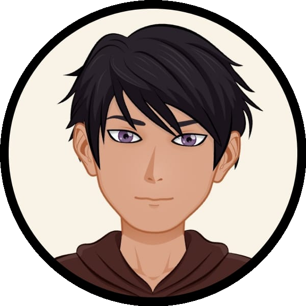

<!-- ========================= HEADER ========================= -->

  

<h1 align="center">Hi 👋, I'm Eswar M</h1>

<h3 align="center">
🚀 Full Stack Developer • AI Integration Engineer • MERN Stack Developer • Software Engineer
</h3>

Building scalable, modern web applications with AI-powered solutions and beautiful user experiences.

---

# 🚀 About Me

💻 Passionate **Full Stack Developer** specializing in **MERN Stack**, **AI Integration**, and **Scalable Backend Systems**.

I enjoy transforming ideas into production-ready applications with clean UI, optimized backend architecture, and intelligent AI-powered features.

### 🌱 Currently Learning

- Docker
- AWS
- Azure
- System Design
- Microservices
- DevOps

### 🔭 Currently Building

- 🚀 LeaveFlow – Enterprise Leave Management System
- 🍽️ FoodieSpace – Recipe Sharing Platform
- 🤖 AI Automation Tools
- 🌐 Freelance Client Projects

### 💬 Ask Me About

- React.js
- TypeScript
- JavaScript
- Node.js
- Express.js
- MongoDB
- Python
- REST APIs
- Prompt Engineering
- UI/UX Design

📫 **Email**

**workofeswarcodes@gmail.com**

🌐 **Portfolio**

https://eswar-portfolio-developer.vercel.app/

📄 Resume

Available in this repository.

---

# 🌟 Featured Projects

## 🚀 LeaveFlow — Leave Management System

Enterprise-grade Leave Approval & Management System.

### Features

- Role-Based Authentication
- HR Dashboard
- Manager Dashboard
- Admin Dashboard
- Employee Dashboard
- Leave Approval Workflow
- MongoDB Atlas
- JWT Authentication
- Modern Responsive UI

🔗 Live Demo

https://leaveflowsystem.vercel.app

---

## 🍽️ FoodieSpace

Modern Recipe Sharing Platform built with MERN Stack.

🔗

https://foodiespace.vercel.app

---

## 🤖 Aura AI

AI Sentiment Analysis Platform using Python, NLP and Streamlit.

🔗

https://eswars-aura-ai.streamlit.app/

---

## 📄 Resume Toolkit

Interactive Resume Builder

🔗

https://resume-toolkites.vercel.app/

---

## 💸 Finance Tracker

Modern Expense & Budget Analytics Dashboard.

🔗

https://finance-tracker-eight-xi.vercel.app

---

## 📚 Study Tracker

Productivity Tracker for Students.

🔗

https://study-tracker-murex.vercel.app

---

## 📸 Polaroid Topaz

Modern Polaroid Gallery UI.

🔗

https://polaroid-topaz.vercel.app

---

## 🤖 Eswar's Chatbot

Conversational AI Chatbot.

🔗

https://eswars-chatbot.streamlit.app/

---

# 💼 Freelance Projects

Worked with startups and businesses to build AI-powered products.

✔ AI Podcaster

✔ AI Rasibalan

✔ Speak to Slides

✔ Chat to Website

✔ Portfolio Websites

✔ Business Landing Pages

✔ AI Automation Solutions

---

# 🛠️ Tech Stack

## 🎨 Frontend

---

## ⚙️ Backend

---

## 🗄️ Databases

---

## ☁️ Cloud & DevOps

---

## 🧰 Tools

---

# 🏆 GitHub Trophies

---

# 📈 GitHub Activity Graph

---

# 📊 GitHub Stats

---

# 📜 Certifications

- IBM Generative AI
- AWS Generative AI
- Elements of AI
- Full Stack Development
- UI/UX Design
- Figma Bootcamp

---

# ⚡ Fun Facts

☕ Coffee + Music + Code = Productivity

🎨 Graphic Designer turned Full Stack Developer

🤖 Passionate about AI-powered Applications

🚀 Always learning new technologies

---

# 🐍 Contribution Snake

---

# 🌐 Connect With Me

&nbsp;

&nbsp;

---

⭐️ From <b>Eswar M</b> | Building the Future with Full Stack Development & AI 🚀

